# 100 Days Of Code

## Log

### Day 000: December 14, 2020 (Calculator)

**Today's Progress**:
Build an online calculator app with vanilla JavaScipt, HMTL and CSS.

**Link to work:**

- <https://github.com/schmelto/calculator>

### Day 001: December 15, 2020 (Ideas - Brainstorming)

**Today's Progress**:
I made a little brainstorm session what projects I can do.
Also I created an Ionic Angular App for my first project the NewsApp and created a first call of the news API.


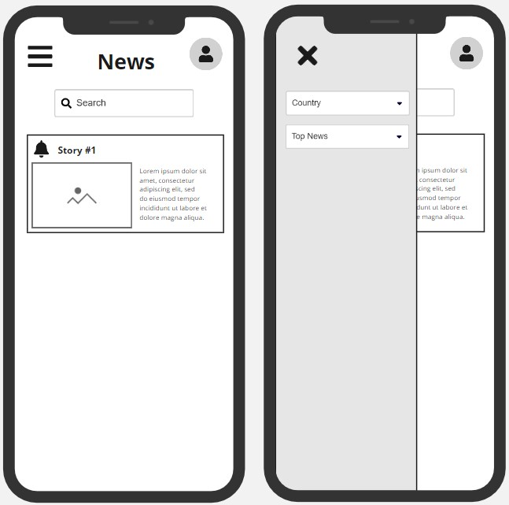

**Link to work:**

- <https://github.com/schmelto/NewsApp>

### Day 002: December 16, 2020 (API-Call)

**Today's Progress**:
I have implemented the right route to newsAPI and added top-headlines and everything.
I tried to add also the country but this will be open for tomorrow. Also the searchstring need to be implemented for "everything".

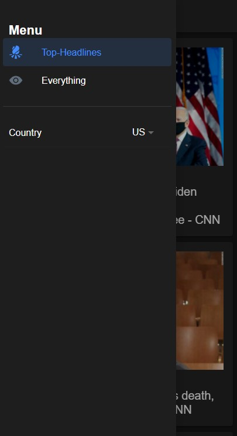

**Link to work:**

- <https://github.com/schmelto/NewsApp/commit/bb910cbd5b2f5d0d3cd9868cd0a9a5de8f22ffa5>

### Day 003: December 17, 2020 (Event Listener)

**Today's Progress**:
Today I implemented an event listener service in which I can handle events from the app page and trigger methods in the folder page/component.

```javascript
import { Injectable } from '@angular/core';
import { Observable, Subject } from 'rxjs';

@Injectable({
  providedIn: 'root'
})
export class EventlistenerService {
  private subject = new Subject<any>();

  sendClickEvent() {
    this.subject.next();
  }

  getClickEvent(): Observable<any>{
    return this.subject.asObservable();
  }

}
```

Also i implemented a search bar for browsing all news.


**Link to work:**

- <https://github.com/schmelto/NewsApp/commit/d7c13807ddec65bd8e5dfac7942bc3e6f73b0df0>
- <https://github.com/schmelto/NewsApp/commit/0ef3ef6d491eaa106ec20788bd349ce2bef3b757>

### Day 004: December 18, 2020 (Verified Infinity Scroll and Reload)

**Today's Progress**:

I've added a GPG Key to verify my commits but this did not work as I want it :D. Futher I addad a infinity scroll with dynamic reload and refresh on pull down.

**Link to work:**

- <https://github.com/schmelto/NewsApp/commit/8854de26fa913867de7422867b379f9c0cd1959d>

### Day 005: December 19, 2020 (Detail-View)

**Today's Progress**:

Today I've added a Detail view the articles in the news app and made a working back button. Further I solved some bugs in the app.


**Link to work:**

- <https://github.com/schmelto/NewsApp/issues/10>

### Day 006: December 20, 2020 (Categories)

**Today's Progress**:

I added category selection to the news app

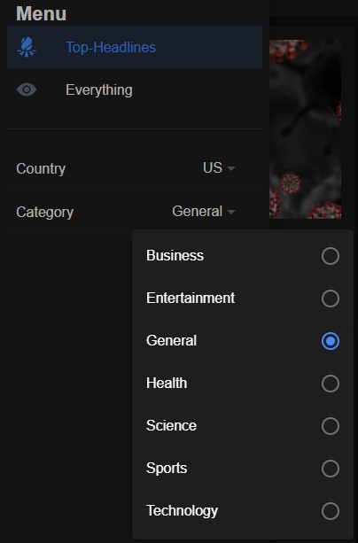

**Link to work:**

- <https://github.com/schmelto/NewsApp/commit/75c35636c14c062431d7149e3e654db69d3ce515>

### Day 007: December 21, 2020 (Selection)

**Today's Progress**:

Today I added lots of select options to the news app and updated the news.service api call.

```javascript
getData(type, country, category, search, page, language, from, to, sortBy) {
  if (type == 'top-headlines') return this.http.get(`${API_URL}/${type}?pageSize=5&page=${page}&country=${country}&category=${category}&apiKey=${API_KEY}`);
  else return this.http.get(`${API_URL}/${type}?pageSize=5&page=${page}&q=${search}&language=${language}&from=${from}&to=${to}&sortBy=${sortBy}&apiKey=${API_KEY}`);
}
```

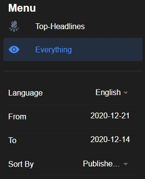

**Link to work:**

- <https://github.com/schmelto/NewsApp/commit/db7d1f71c8ca26ec798f6a3779940092e82dcf8c>

### Day 008: December 22, 2020 (Release)

**Today's Progress**:

I resolve the last bugs in the news app and tried to release it to my android phone.

**Link to work:**

- <https://github.com/schmelto/NewsApp/commit/5ec22a9fd8846a1d82f3bf595588b777002797d1>

### Day 009: December 23, 2020 (Release V1.0.0)

**Today's Progress**:

I released version 1.0.0 of the app as signed apk for android and installed the app on my phone.
Since this project is finished for now I have to look for something new for the #100daysofcode challange.
But this is something for tomorrow :) because tomorrow it's the 24th December (Christmas :christmas_tree:).

**Link to work:**

- <https://github.com/schmelto/NewsApp/releases/tag/1.0.0>

### Day 010: December 24, 2020 (Found A BUG!!!!)

**Today's Progress**:

Found a bug in the news app and can't find the solution it does not reset the parameters and data after changing one of them after loading page 2 or more... Opened a question on StackOverflow.

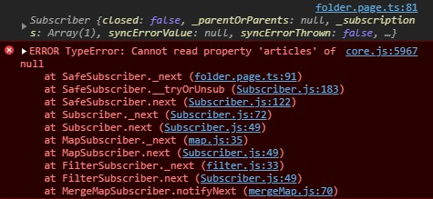

**Link to work:**

- <https://stackoverflow.com/questions/65440704/how-to-wait-for-methods-called-in-a-subscription>

### Day 011: December 25, 2020 (Resolved the Bug finally _\__)

**Today's Progress**:

Finally resolved the bug _\__ Now lets move on!
Remindner for me dont use the `ngOnInit()`-Function somewhere else!!!

Now I want to go for the webcrawler-project or some data science stuff. Lets get starting with Python for this!
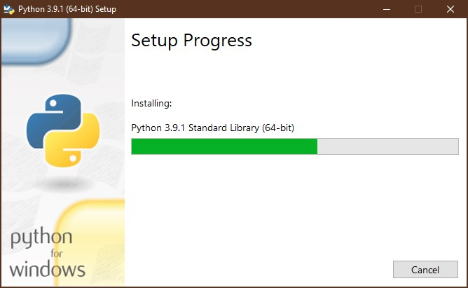

**Link to work:**

- <https://github.com/schmelto/NewsApp/commit/4d285cce866103262d5bfb691bbf390d895de647>

### Day 012: December 26, 2020 (Tensorflow)

**Today's Progress**:

I started the FreeCodeCamps Mashine Learning Course not initialy the idea behind 100daysofcode but I need those information for some data science stuff programms I want to build :)

**Link to work:**

- <https://github.com/schmelto/machine-learning-with-python>

### Day 013: December 27, 2020 (Release 1.0.1)

**Today's Progress**:

Little bit lazy today but released v1.0.1 for the news app

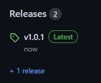

**Link to work:**

- <https://github.com/schmelto/NewsApp/commit/32e81e6c95b66061d315a73da4e3a73dd1cfa9f2>

### Day 014: December 28, 2020 (Release 1.0.2 & Machine Learning)

**Today's Progress**:

Today fixt an other bug in the news app and release it to version 1.0.2 :] somehow it's getting better over time.
Futher I look a little bit at the titanic dataset from tensorflow.

```python
dftrain = pd.read_csv('https://storage.googleapis.com/tf-datasets/titanic/train.csv') # training data
dfeval = pd.read_csv('https://storage.googleapis.com/tf-datasets/titanic/eval.csv') # testing data

dftrain.head()
```

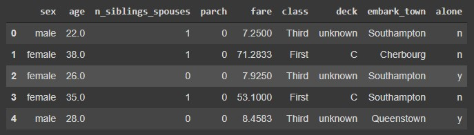

**Link to work:**

- <https://github.com/schmelto/NewsApp/commit/bbaa65fe54c788e8cce072c0557231bf0100866c>
- <https://colab.research.google.com/github/schmelto/machine-learning-with-python/blob/main/Core_Learning_Algorithms.ipynb#scrollTo=CpllWsKIOGOy>

### Day 015: December 29, 2020 (Tensorflow Core Algorithms)

**Today's Progress**:

I've learnd something about model prediction with Tensorflow

```python
def make_input_fn(data_df, label_df, num_epochs=10, shuffle=True, batch_size=32):
  def input_function():  # inner function, this will be returned
    ds = tf.data.Dataset.from_tensor_slices((dict(data_df), label_df))  # create tf.data.Dataset object with data and its label
    if shuffle:
      ds = ds.shuffle(1000)  # randomize order of data
    ds = ds.batch(batch_size).repeat(num_epochs)  # split dataset into batches of 32 and repeat process for number of epochs
    return ds  # return a batch of the dataset
  return input_function  # return a function object for use

train_input_fn = make_input_fn(dftrain, y_train)  # here we will call the input_function that was returned to us to get a dataset object we can feed to the model
eval_input_fn = make_input_fn(dfeval, y_eval, num_epochs=1, shuffle=False)
```

**Link to work:**

- <https://colab.research.google.com/github/schmelto/machine-learning-with-python/blob/main/Core_Learning_Algorithms.ipynb#scrollTo=CpllWsKIOGOy>

### Day 016: December 30, 2020 (More learning)

**Today's Progress**:

Learned something more

**Link to work:**

- <https://github.com/schmelto/machine-learning-with-python/commit/f4ab2fbc9e5adacfacdee2cc01c50974e62ad471>

### Day 017: December 31, 2020 (Deeplearning with Python - MNIST)

**Today's Progress**:

I created a little model for prediction the MNIST-Dataset.

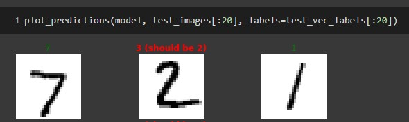

**Link to work:**

- <https://github.com/schmelto/machine-learning-with-python/commit/76ea931acc90d55566214aa961e9f8792e5f695d>

### Day 018: Januar 01, 2021 (Fashion MNIST)

**Today's Progress**:

I tried on myself to predict the fashion MNIST dataset.

```python
import tensorflow as tf
from tensorflow import keras
import numpy as np
import matplotlib.pyplot as plt

data = keras.datasets.fashion_mnist
(train_images, train_labels), (test_images, test_labels) = data.load_data()

train_images = train_images / 255.0
test_images = test_images / 255.0

total_classes = 10
train_vec_labels = keras.utils.to_categorical(train_labels, total_classes)
test_vec_labels = keras.utils.to_categorical(test_labels, total_classes)

model = keras.Sequential([
    keras.layers.Flatten(input_shape=(28, 28)),
    keras.layers.Dense(128, activation='sigmoid'),
    keras.layers.Dense(10, activation='sigmoid')
])

model.compile(
    optimizer='sgd',
    loss='mean_squared_error',
    metrics=['accuracy'])

model.fit(train_images, train_vec_labels, epochs=50, verbose=True)

eval_loss, eval_accuracy = model.evaluate(test_images, test_vec_labels, verbose=False)
print("Model accuracy: %.2f" % eval_accuracy)
```

Further I added a [README](https://github.com/schmelto/NewsApp/commit/d59b4b0f05f71e9bd9756145ca8808c990afd36f) to the NewsApp.

**Link to work:**

- <https://github.com/schmelto/machine-learning-with-python/commit/0e1a3763c94e539abccf9641d7f495d832c080f2>
- <https://github.com/schmelto/NewsApp/blob/master/README.md> | <https://github.com/schmelto/NewsApp/commit/d59b4b0f05f71e9bd9756145ca8808c990afd36f>

### Day 019: Januar 02, 2021 (README)

**Today's Progress**:

I've updated the [README](https://github.com/schmelto/NewsApp#readme) of the [NewsApp](https://github.com/schmelto/NewsApp) and made some cool badges:


Further I made some small changes in the [machine learning](https://github.com/schmelto/machine-learning) repo. Also I added an introduction to Numpy and evaluated activation functions of the newtworks.

```python
model_relu = keras.Sequential([
    keras.layers.Flatten(input_shape=(28, 28)),
    keras.layers.Dense(128, activation='relu'),
    keras.layers.Dense(10, activation='sigmoid')
])

model_linear = keras.Sequential([
    keras.layers.Flatten(input_shape=(28, 28)),
    keras.layers.Dense(128, activation='linear'),
    keras.layers.Dense(10, activation='linear')
])

model_sigmoid = keras.Sequential([
    keras.layers.Flatten(input_shape=(28, 28)),
    keras.layers.Dense(128, activation='sigmoid'),
    keras.layers.Dense(10, activation='sigmoid')
])

model_tanh = keras.Sequential([
    keras.layers.Flatten(input_shape=(28, 28)),
    keras.layers.Dense(128, activation='tanh'),
    keras.layers.Dense(10, activation='tanh')
])

models = [model_relu, model_linear,
          model_sigmoid,model_tanh]
```

**Link to work:**

- <https://github.com/schmelto/NewsApp/commit/087b74d13fa5288b79992ccfb6cea29097bcc00b>
- <https://github.com/schmelto/machine-learning/commit/15abacab04630dd2ae377e55046869cd72205b61>

### Day 020: Januar 03, 2021 (Numpy)

**Today's Progress**:

Finished the Numpy introduction ([here](https://github.com/schmelto/machine-learning/blob/main/Deeplearning/introduction_to_numpy.ipynb)) and have the idea for the #100daysofcode challenge to build an app that recognize handwriting via camera. Maybe give it a try :D ([here](https://github.com/schmelto/text-recognition))

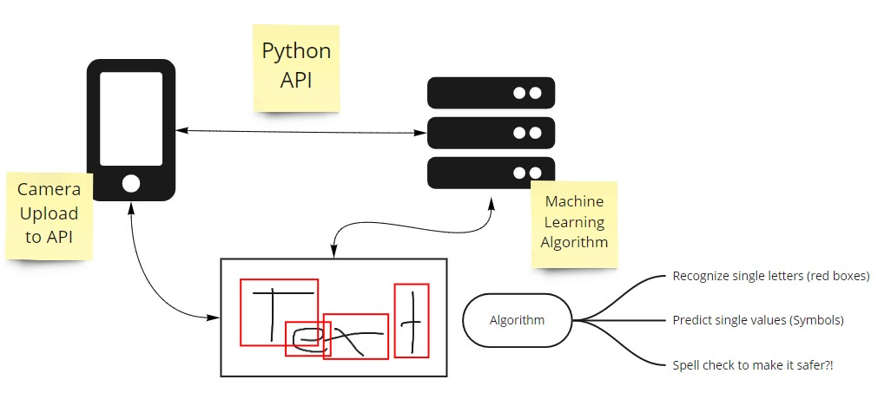

**Link to work:**

- <https://github.com/schmelto/machine-learning/commit/c689089b36552d9fc560a13d38b8dbd7aedc2bbc>

### Day 021: Januar 04, 2021 (Maploitlib)

**Today's Progress**:

I've created an introduction to Maploitlib and plotted some plots :D

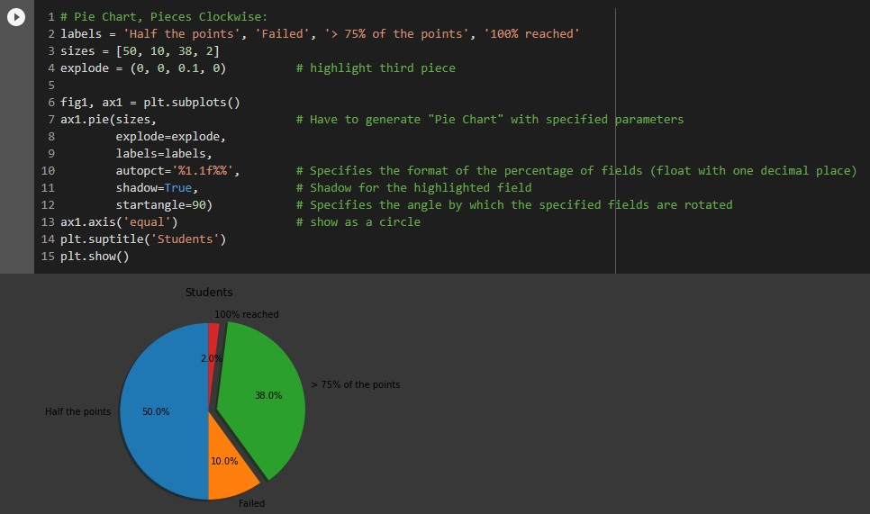

**Link to work:**

- <https://github.com/schmelto/machine-learning/commit/c8cbc0c68f01c2c2721894fff7bd5980c122529c>

### Day 022: Januar 05, 2021 (Keras / Tensorflow / MNIST)

**Today's Progress**:

I take a deeper look at Keras, Tensorflow and analyzed the MNIST dataset.

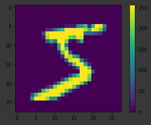

**Link to work:**

- <https://github.com/schmelto/machine-learning/commit/dbc504d25c7c2861d0d73dd0cd4f03ab55345dd2>

### Day 023: Januar 06, 2021 (Complex layer structure)

**Today's Progress**:

I take a look at complex layer structure.

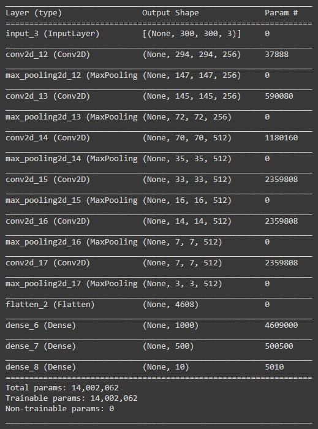

**Link to work:**

- <https://github.com/schmelto/machine-learning/commit/9f543cb5630bb46a7fe7f908265e636196d79253>

### Day 024: Januar 07, 2021 (Loss Functions)

**Today's Progress**:

I optimized the models with loss functions

```python
optimizer = 'sgd'

model_mse.compile(
    optimizer=optimizer,
    loss='mean_squared_error',
    metrics=['accuracy']
)
model_cce.compile(
    optimizer=optimizer,
    loss='categorical_crossentropy',
    metrics=['accuracy']
)
model_scce.compile(
    optimizer=optimizer,
    loss='sparse_categorical_crossentropy',
    metrics=['accuracy']
)
```

**Link to work:**

- <https://github.com/schmelto/machine-learning/commit/e8db352a8ce8817df070a6927f737441c4d3b21c>

### Day 025: Januar 08, 2021 (Optimizer and Hyperparameters)

**Today's Progress**:

Today I've taked a look on how I can optimize my models wit Optimizer and Hyperparameters.

```python
model.compile(
    optimizer = tf.keras.optimizers.Adam(lr=0.001),
    loss='categorical_crossentropy',
    metrics=['accuracy']
)
```

**Link to work:**

- <https://github.com/schmelto/machine-learning/commit/6af1353a3166fb83552b0e3a35a5a93159c9fa16>
- <https://github.com/schmelto/machine-learning/commit/210d38408c687e533ef50fc5603e7bd2d811acc9>

### Day 026: Januar 09, 2021 (Hyperparameters Part II)

**Today's Progress**:

Today I've taked a look on how to optimize hyperparameters.

**Link to work:**

- <https://github.com/schmelto/machine-learning/commit/f20c77b85b0ae24c460c104d6674228b61cfc74f>

### Day 027: Januar 10, 2021 (Dropout)

**Today's Progress**:

Wonder if dropout also would work in companies :) But today I've learned it work for neuronal networks and that's kind of satisfying.

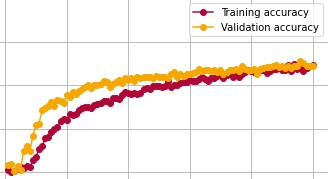

**Link to work:**

- <https://github.com/schmelto/machine-learning/commit/dbf57462612053c2417451ce8e35b03683583c8a>

### Day 028: Januar 11, 2021 (Data Argumentation)

**Today's Progress**:

Little bit Data Argumentation.

**Link to work:**

- <https://github.com/schmelto/machine-learning/commit/0c3f64b471271d2ff3b3b5382e91a428417f1111>

### Day 029: Januar 12, 2021 (Some thinking + start app)

**Today's Progress**:

Today it was very hard to motivate myself for the #100daysofcode challange. But here I am. I want to start the app for taking pictures for the text recognition.

```javascript
import { Injectable } from '@angular/core';
import { Plugins, CameraResultType, CameraSource } from '@capacitor/core';

const { Camera } = Plugins;

@Injectable({
  providedIn: 'root'
})
export class PhotoService {

  public photos: Photo[] = [];

  constructor() { }

  public async addNewToGallery() {

    const capturedPhoto = await Camera.getPhoto({
      resultType: CameraResultType.Uri,
      source: CameraSource.Camera,
      quality: 100
    });

    this.photos.unshift({
      filepath: "soon...",
      webviewPath: capturedPhoto.webPath
    });
  }
}

export interface Photo {
  filepath: string;
  webviewPath: string;
}
```

**Link to work:**

- <https://github.com/schmelto/text-recognition/commit/cbb549d642db4f874be0e4af8ef25d825f22e226>

### Day 030: Januar 13, 2021 (API)

**Today's Progress**:

Started to build a Python API. But worked not that great dont know why I cant read a file in the same direktory.

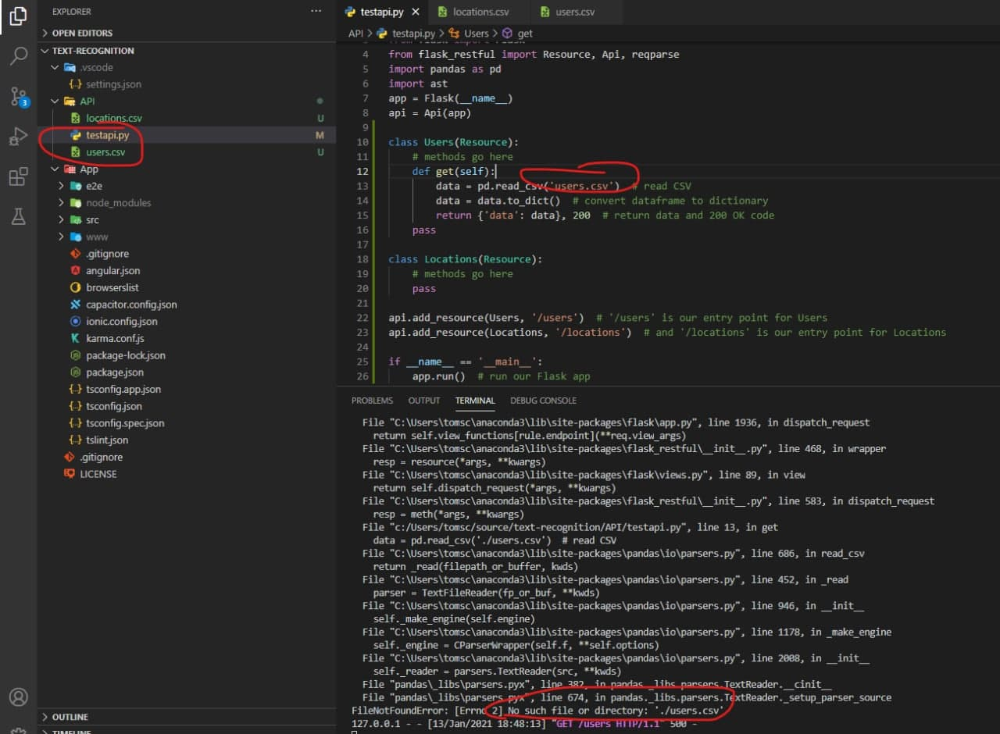

**Link to work:**

- <https://github.com/schmelto/text-recognition/commit/084fa74f68a915147b07de48f9b3e4f250ae358b>

### Day 031: Januar 14, 2021 (API - Yes I've got it)

**Today's Progress**:

Ok I don't know why but if I pass the whole path to for the csv it worked in the API.

```python
data = pd.read_csv('C:/Users/tomsc/source/text-recognition/API/users.csv')  # read CSV
```

```json
{
    "data": {
        "userId": {
            "0": "a1b",
            "1": "a2c",
            "2": "b1b",
            "3": "b2c"
        },
        "name": {
            "0": "Joe",
            "1": "Jenny",
[...]
}
```

So lets provide some example mehtods in the API that I can use for later purposes.

**Link to work:**

- <https://github.com/schmelto/text-recognition/issues/4>

### Day 032: Januar 15, 2021 (API - first model)

**Today's Progress**:

Finally I can train the model on my local machine and return some parameters in the flask API.

For example gicing the model back in a get method:

```json
{
  "data": "{\"class_name\": \"Sequential\", \"config\": {\"name\": \"sequential\", \"layers\": [{\"class_name\": \"InputLayer\", \"config\": {\"batch_input_shape\": [null, 28, 28], \"dtype\": \"float32\", \"sparse\": false, \"ragged\": false, \"name\": \"flatten_input\"}}, {\"class_name\": \"Flatten\", \"config\": {\"name\": \"flatten\", \"trainable\": true, \"batch_input_shape\": [null, 28, 28], \"dtype\": \"float32\", \"data_format\": \"channels_last\"}}, {\"class_name\": \"Dense\", \"config\": {\"name\": \"dense\", \"trainable\": true, \"dtype\": \"float32\", \"units\": 128, \"activation\": \"sigmoid\", \"use_bias\": true, \"kernel_initializer\": {\"class_name\": \"GlorotUniform\", \"config\": {\"seed\": null}}, \"bias_initializer\": {\"class_name\": \"Zeros\", \"config\": {}}, \"kernel_regularizer\": null, \"bias_regularizer\": null, \"activity_regularizer\": null, \"kernel_constraint\": null, \"bias_constraint\": null}}, {\"class_name\": \"Dense\", \"config\": {\"name\": \"dense_1\", \"trainable\": true, \"dtype\": \"float32\", \"units\": 10, \"activation\": \"sigmoid\", \"use_bias\": true, \"kernel_initializer\": {\"class_name\": \"GlorotUniform\", \"config\": {\"seed\": null}}, \"bias_initializer\": {\"class_name\": \"Zeros\", \"config\": {}}, \"kernel_regularizer\": null, \"bias_regularizer\": null, \"activity_regularizer\": null, \"kernel_constraint\": null, \"bias_constraint\": null}}]}, \"keras_version\": \"2.4.0\", \"backend\": \"tensorflow\"}"
}
```

**Link to work:**

- <https://github.com/schmelto/text-recognition/pull/6>

### Day 033: Januar 16, 2021 (API call in app)

**Today's Progress**:

Today I started with calling the API in the Ionic App but I have to adjust the [CORS policy](https://github.com/schmelto/text-recognition/issues/9).

```json
Access to XMLHttpRequest at 'http://127.0.0.1:5000/model/model' from origin 'http://localhost:8100' has been blocked by CORS policy: No 'Access-Control-Allow-Origin' header is present on the requested resource.
```

**Link to work:**

- <https://github.com/schmelto/text-recognition/issues/9>
- <https://github.com/schmelto/text-recognition/commit/564a275a94e5ac2e2598fe3f6abea0c76a0f981d>

### Day 034: Januar 17, 2021 (CORS Policy)

**Today's Progress**:

Updated the CORS Policy of my test API with `from flask_cors import CORS`. Now I can call the api from my ionic app. Also tried to add the POST API call.

**Link to work:**

- <https://github.com/schmelto/text-recognition/pull/10>
- <https://github.com/schmelto/text-recognition/tree/serviceapi>

### Day 035: Januar 18, 2021 (Post API)

**Today's Progress**:

I'm not that far as I wanted to be but I finally get the POST Method to work in the python API and can call it rudimentary in the ionic app. Fine Tuning necessary!!

```python
@app.route('/model', methods=('POST',))
def post():
    filepath = request.args.get('filepath') #if key doesn't exist, returns None
    webviewPath = request.args['webviewPath'] #if key doesn't exist, returns a 400, bad request error

    return jsonify(webviewPath), 200  # return data with 200 OK
```

```js
http://127.0.0.1:5000/model?filepath=test&webviewPath=test
```

**Link to work:**

- <https://github.com/schmelto/text-recognition/commit/23f51bdfdd4123e079375b30805a6d51958d4b9c>

### Day 036: Januar 19, 2021 (Post API 2.0)

**Today's Progress**:

Got the API working from Postman and from the Ionic app and get some test return parameters. Now I have to look how I can download the img in my api and predict it with my model. But this is something for tomorrow.

Also I have the idea to make a labeling system into the app.

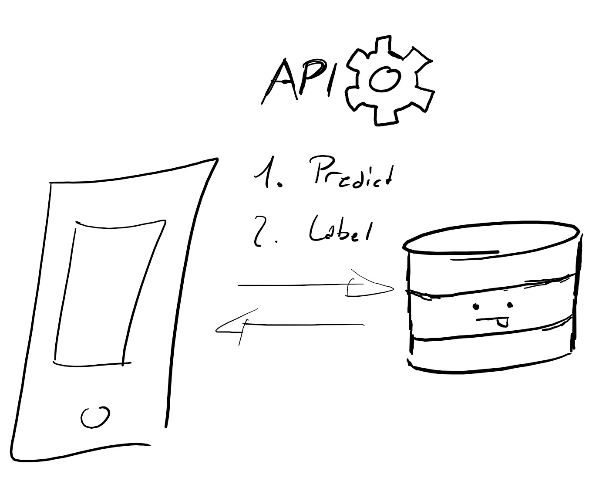

**Link to work:**

- <https://github.com/schmelto/text-recognition/commit/64779be892663eac3fb981f88943686edd66efe7>

### Day 037: Januar 20, 2021 (Github Actions)

**Today's Progress**:

Today a little bit off topic but I added github workflows / github actions to my 100daysofcode repo to automatically merge the Pull requests from the [ImgBot](https://github.com/ImgBotApp).

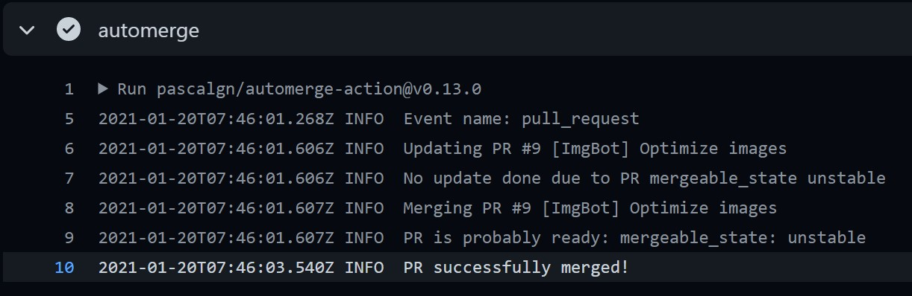

**Link to work:**

- <https://github.com/schmelto/100-days-of-code/commit/1cbe71cb053b7e89e6af7eb73f983f706d742ebc>

### Day 038: Januar 21, 2021 (Image?!)

**Today's Progress**:

Got a little bit stuck with all the python imports image processing and load into a dataset...

**Link to work:**

- <https://github.com/schmelto/text-recognition/commit/6d73c995e26247f9797dd4b1fa39691accf120a0>

### Day 039: Januar 22, 2021 (Python Scripts)

**Today's Progress**:

Cause I currently sorting my old pictures I worte me a little python script that allows me to rename all my pictures.

```python
import os

url = "url" + "/"
extensions = ('.jpg', '.JPG')

# Function to rename multiple files
def main():
    for count, file in enumerate(os.listdir(url)):
        if file.endswith(extensions):
            dst = "Filename" + str(count) + ".jpg"
            src = url + file
            dst = url + dst

            # rename() function will rename all the files
            os.rename(src, dst)

# Driver Code
if __name__ == '__main__':

    # Calling main() function
    main()
```

**Link to work:**

- <https://github.com/schmelto/python-scripts/commit/e580013bc9fbf679bc8c698e123e09e77e6fc48a>

### Day 040: Januar 23, 2021 (Python Script Update)

**Today's Progress**:

Little bit updated my python rename script. Why does Python have no number increment?!

**Link to work:**

- <https://github.com/schmelto/python-scripts/commit/96991a03bdf7352322ba62105bcaa614f2851f96>

### Day 041: Januar 24, 2021 (Python Script Update 2.0)

**Today's Progress**:

Updated my rename script to use the main folder and rename pictures in subfolders.

```python
# This program rename all images to "foldername - number"
# structure of the folders like
#
# - main photo folder
#   - 2021 - pictures 1
#   - 2021 - pictures 2
#
# this will rename photo 1 in folder "2021 - pictures 1" to "2021 - pictures 1 - 1" and so on
# currently only .jpg and .png files are supported
# subfolders within the picture folders are not supported
```

**Link to work:**

- <https://github.com/schmelto/python-scripts/commit/7c2183945c057779f65e27bcb5fcbb30c273b841>

### Day 042: Januar 25, 2021 (Back to text)

**Today's Progress**:

I am not sure what I really did today, progress very little but I tried to get an image from my local computer to be predicted with my keras model. Didn't worked as I planed. But hey today is day 42 and you know 42 is the answer to everything.

**Link to work:**

- <https://github.com/schmelto/text-recognition/commit/73977dd7db7aee9d6c889246f235f4c627f544cc>

### Day 043: Januar 26, 2021 (Back to text wait what)

**Today's Progress**:

Programmed a little bit but nothing really done to commit today... Don't know why it will not work.

**Link to work:**

- n/a

### Day 044: Januar 27, 2021 (Open Source)

**Today's Progress**:

Cause I watched yesterdays livestream with [@EddieJaoude](https://github.com/eddiejaoude) I contributed today to open source.

**Link to work:**

- <https://github.com/EddieJaoudeCommunity/EddieBot/pull/431>

### Day 045: Januar 28, 2021 (Battlesnake)

**Today's Progress**:

Today I started building a #BattleSnake and made it run locally on my machine with ngrok.

**Link to work:**

- <https://github.com/schmelto/battlesnake-python>

### Day 046: Januar 29, 2021 (Snake Object)

**Today's Progress**:

Created snake objects and analyzed the battle api.

```python
class Snake():
    def __init__(self, snake):
        self.id = snake['id']
        self.name = snake['name']
        self.health = snake['health']
        self.body = snake['body']
        self.head = snake['head']
        self.length = snake['length']
```

**Link to work:**

- <https://github.com/schmelto/battlesnake-python/commit/73eeba647abc2e0b3ad16f63f243b57930375cbe>

### Day 047: Januar 30, 2021 (more Battlesnake)

**Today's Progress**:

Some more Battlesnake.

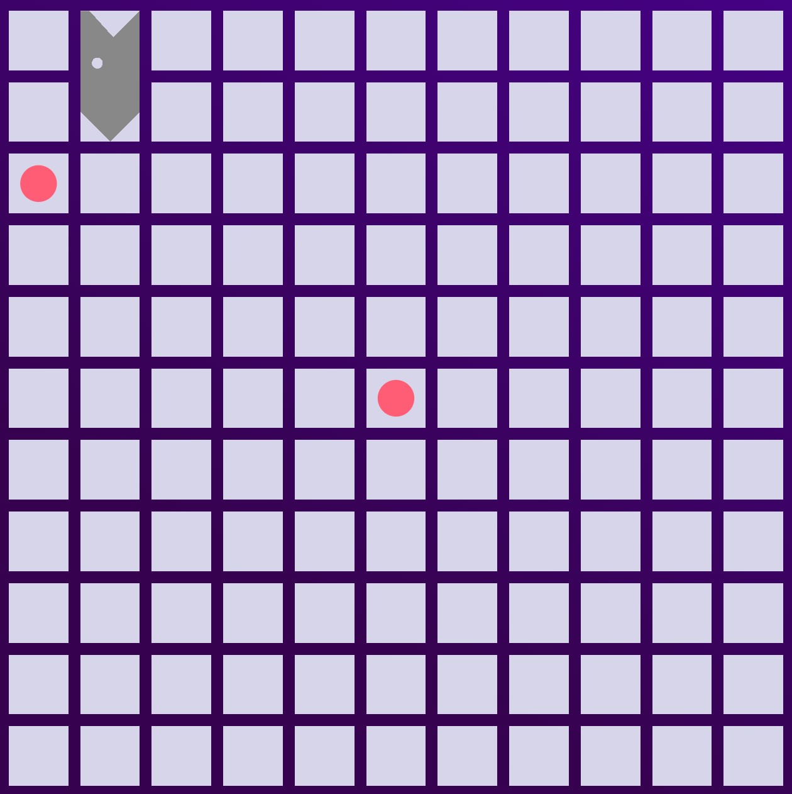

**Link to work:**

- <https://github.com/schmelto/battlesnake-python/commit/06278debc47cb376d619cc6e69a95d19be06235b>

### Day 048: Januar 31, 2021 (and some more Battlesnake)

**Today's Progress**:

Get the directions right for my snake and added a wall collision detection.

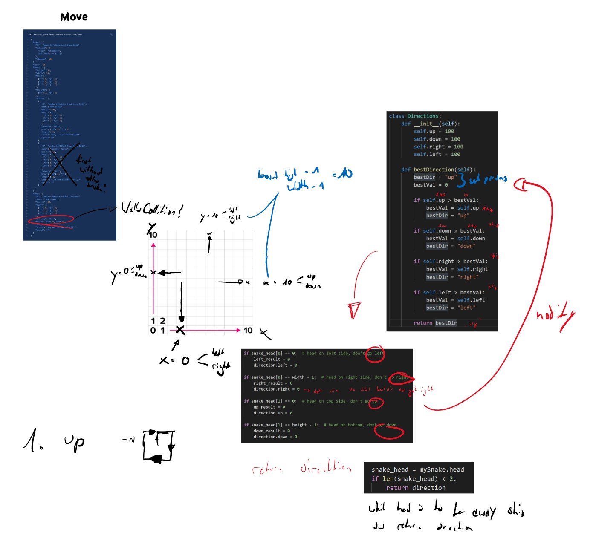

**Link to work:**

- <https://github.com/schmelto/battlesnake-python/commit/77ef258b85a8401c367db01e813c6da571db201b>

### Day 049: Februar 1, 2021 (some cleaning)

**Today's Progress**:

Some cleaning and styling of my repos.

**Link to work:**

- <https://github.com/schmelto/NewsApp/commit/16ec29c982c1dda1dc278a64dd30386ec0357192>

### Day 050: Februar 2, 2021 (Open-source)

**Today's Progress**:

Contributed to [EddieHubCommunity](https://github.com/EddieHubCommunity) and make some adjustments to my battlesnake

**Link to work:**

- <https://github.com/EddieHubCommunity/support/pull/847>
- <https://github.com/schmelto/battlesnake-python/commit/799b8f30982fd43f67df6827e3b2a1563627ec1d>

### Day 051: Februar 3, 2021 (Open-source)

**Today's Progress**:

Made a lot of contributions and got my first PR merged in the NewsApp

**Link to work:**

- <https://github.com/EddieHubCommunity/support/pull/852>
- <https://github.com/EddieHubCommunity/gh-action-community/pull/62>
- <https://github.com/schmelto/NewsApp/pull/34>

### Day 052: Februar 4, 2021 (Selfcollition)

**Today's Progress**:

Made a self collition detection for my battlesnake.

```python
def checkForOwnBody(self, data, directions, mySnake):

  snake_head = mySnake.head
  snake_body = mySnake.body

  for pointInBody in snake_body:

      if snake_head["x"] == pointInBody["x"] - 1 and snake_head["y"] == pointInBody["y"]:
          directions.right = 0
      if snake_head["x"] == pointInBody["x"] + 1 and snake_head["y"] == pointInBody["y"]:
          directions.left = 0
      if snake_head["y"] == pointInBody["y"] - 1 and snake_head["x"] == pointInBody["x"]:
          directions.up = 0
      if snake_head["y"] == pointInBody["y"] + 1 and snake_head["x"] == pointInBody["x"]:
          directions.down = 0

  return directions
```

**Link to work:**

- <https://github.com/schmelto/battlesnake-python/commit/09471b863c20c6e9eaac0fee2d8535452ee8bae8>

### Day 053: Februar 5, 2021 (Food)

**Today's Progress**:

Gave some food to my battlesnake (not working right now...) poor battlesnake.

**Link to work:**

- <https://github.com/schmelto/battlesnake-python/commit/63cd8938b905ff61092937449a5f276f529008d7>

### Day 054: Februar 6, 2021 (adjustments)

**Today's Progress**:

Small adjustments.

**Link to work:**

- <https://github.com/schmelto/battlesnake-python/commit/b6e41f91eb8d5c71e9d6c1029a7a5d21bce8eb01>

### Day 055: Februar 7, 2021 (finally got some food)

**Today's Progress**:

Some Donuts aka food for my battlesnake.

**Link to work:**

- <https://github.com/schmelto/battlesnake-python/commit/359a9ca4c9a32fa98c9ee319932cb8440c6253c6>

### Day 056: Februar 8, 2021 (Portfolio)

**Today's Progress**:

Started to build a portfolio

**Link to work:**

- <https://github.com/schmelto/portfolio/commit/37b0915585ba1817f52f83218805fe6bff5476ab>

### Day 057: Februar 9, 2021 (Portfolio)

**Today's Progress**:

Updated my portfolio website wiht a text carousel.

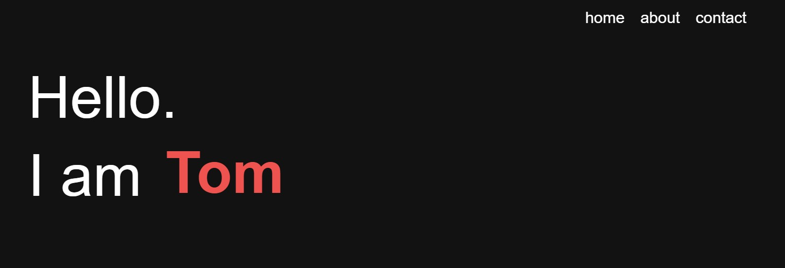
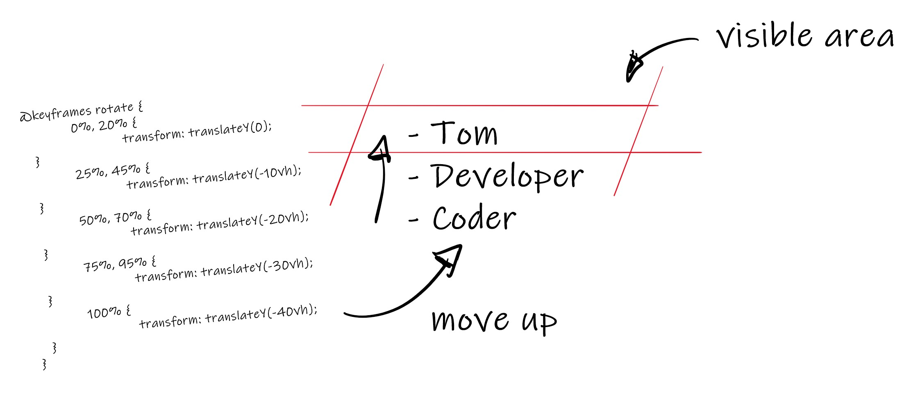

**Link to work:**

- <https://github.com/schmelto/portfolio/commit/fb196d212c821d69824cea2550f11880d3362fc6>

### Day 058: Februar 10, 2021 (Portfolio)

**Today's Progress**:

Updated my portfolio website.

**Link to work:**

- <https://github.com/schmelto/portfolio/commit/9c1f7610815fe2eb486cdaaf7804ea9cf2157bd4>

### Day 059: Februar 11, 2021 (Portfolio)

**Today's Progress**:

Made some typewrting text and add some content.

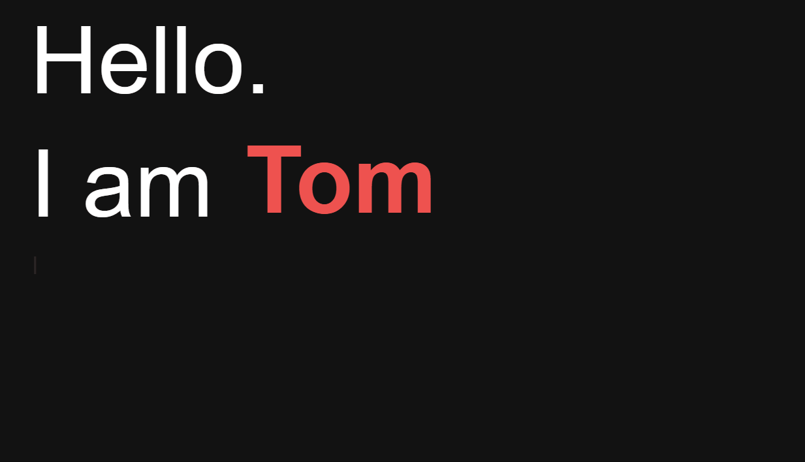

**Link to work:**

- <https://github.com/schmelto/portfolio/commit/f092fecea781cae1aff6ac1f013a94c59af869c7>

### Day 060: Februar 12, 2021 (Portfolio)

**Today's Progress**:

add some assets

**Link to work:**

- <https://github.com/schmelto/portfolio/commit/1dce59feb317f74e49c6227d0dd58ceec0c73008>

### Day 061: Februar 13, 2021 (Portfolio)

**Today's Progress**:

Update portfolio

**Link to work:**

- n/a

### Day 062: Februar 14, 2021 (Portfolio)

**Today's Progress**:

Can't really do anything due outage of internet

**Link to work:**

- n/a

### Day 063: Februar 15, 2021 (Portfolio)

**Today's Progress**:

Made my porfolio little bit more responsive.

**Link to work:**

- <https://github.com/schmelto/portfolio/commit/1415c84a0b16c31ef30f0119c69b52346fdff0c6>

### Day 064: Februar 16, 2021 (Stuff)

**Today's Progress**:

Thought about an icon for the NewsApp.


Further I fixed some issues in my portfolio

**Link to work:**

- <https://github.com/schmelto/portfolio/commit/1635274c310e907ed57428c29dbaca50ec00244c>

### Day 065: Februar 17, 2021 (Contact Form)

**Today's Progress**:

Added a JavaScript E-Mail Contact Form to my protfolio

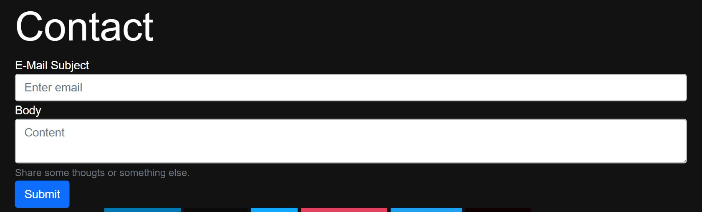

**Link to work:**

- <https://github.com/schmelto/portfolio/commit/7b4fe656a0661514029cd881251e125da0aadbb3>

### Day 066: Februar 18, 2021 (socials)

**Today's Progress**:

Resolved and added some bugs to my portfolio and align the socials -> released to github pages

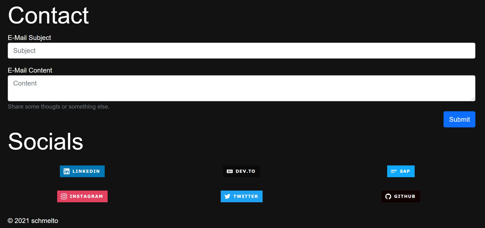

**Link to work:**

- <https://github.com/schmelto/portfolio/commit/7b4fe656a0661514029cd881251e125da0aadbb3>

### Day 067: Februar 19, 2021 (projects)

**Today's Progress**:

Added some projects to my websotewebsite

**Link to work:**

- <https://github.com/schmelto/portfolio/commit/f2fc246663ffaad3b8301b94d562a3b134103a92>

### Day 068: Februar 20, 2021 (portfolio)

**Today's Progress**:

small improvements

**Link to work:**

- n/a

### Day 069: Februar 21, 2021 (portfolio)

**Today's Progress**:
adjsutements

**Link to work:**

- n/a

### Day 070: Februar 22, 2021 (portfolio)

**Today's Progress**:

Fixed the last issues and released version v1.1.0 of my developer portfolio website.

**Link to work:**

- <https://github.com/schmelto/portfolio/releases/tag/v.1.1.0>

### Day 071: Februar 23, 2021 (own operating system)

**Today's Progress**:

Started to build my own operating system.


**Link to work:**

- <https://github.com/schmelto/operating-system/commit/1b542f29dfd31513f63ebc000abaa68cf4dd052f>
- <https://github.com/schmelto/operating-system/commit/413341bfe59627625a4390932d28c3bc135eedb1>

### Day 072: Februar 24, 2021 (own operating system)

**Today's Progress**:

Convert to 64 bit and long mode added c language support

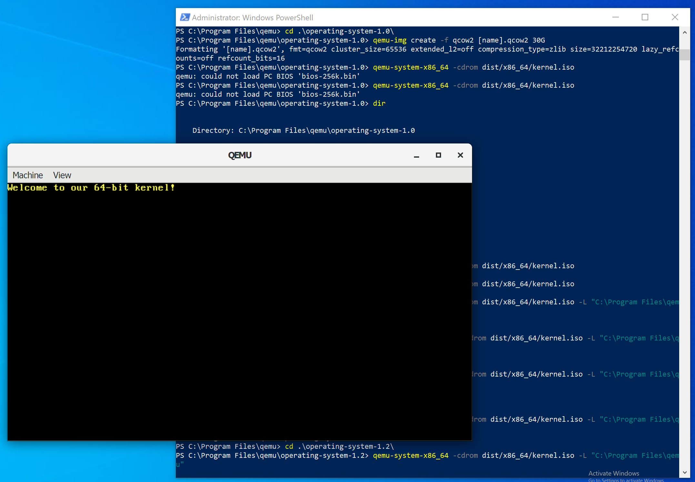

**Link to work:**

- <https://github.com/schmelto/operating-system/releases/tag/v1.2>

### Day 073: Februar 25, 2021 (clean ups some code)

**Today's Progress**:

clean up some code

**Link to work:**

- n/a

### Day 074: Februar 26, 2021 (potato app)

**Today's Progress**:

Started an ionic angular porato salada app.

**Link to work:**

- <https://github.com/schmelto/potato-app/commit/5ad04a96a92a9dfaf79b3d1cd13358c7cb28f09a>

### Day 075: Februar 27, 2021 (wireframe)

**Today's Progress**:

Coding and wireframing for the potato app

**Link to work:**

- <https://github.com/schmelto/potato-app/commit/0a6314e27b396ceecbb0b92aa5a8f81ac5fbaaa3>

### Day 076: Februar 28, 2021 (android app)

**Today's Progress**:

Finsihed the potato-salad app and realesaed it on android.

**Link to work:**

- <https://github.com/schmelto/potato-app/commit/75b744269dcad3700fbf9aa477289f273d0d54c2>

### Day 077: March 01, 2021 (clean up)

**Today's Progress**:

due of @eddiejaoude livestream started to create an issue for nearly everything :) and cleaned up some code in the potato salad app and released version v1.0.

**Link to work:**

- <https://github.com/schmelto/potato-app/commit/56a7a0e250fd131b645bafd40b495bd1df5fbdc6>

### Day 078: March 02, 2021 (3d)

**Today's Progress**:

add a cool 3d render

**Link to work:**

- <https://github.com/schmelto/potato-app/commit/fe5bd100788a5d33e6fdfdaf3e096d7956304545>

### Day 079: March 03, 2021 (resolved and added some issues)

**Today's Progress**:

resolved and added some issues

**Link to work:**

- <https://github.com/schmelto/portfolio/commit/d1aa681beed737743733ba8f3db4fe00ecb58dc3>

### Day 080: March 04, 2021 (Flutter)

**Today's Progress**:

Stared to learn some Flutter and created my first flutter app

**Link to work:**

- <https://github.com/schmelto/startup_namer/commit/c0b5eb26c896db797bd5c0e98a7f0f63d5e38e14>

### Day 081: March 05, 2021 (Finished the potato app)

**Today's Progress**:

Finished the potato app -> got the final app icon today and releaded the apk file

**Link to work:**

- <https://github.com/schmelto/potato-app/commit/d4a15c7a9c0f2d6db2d31e812af73581fa536f20>

### Day 082: March 06, 2021 (Improvements)

**Today's Progress**:

added some features to the app

**Link to work:**

- <https://github.com/schmelto/potato-app/commit/5cb81c41cb36e65f559228639a71e5e68edd1f49>

### Day 083: March 07, 2021 (i18n)

**Today's Progress**:
added language suppoert with i18n files to the app

**Link to work:**

- <https://github.com/schmelto/potato-app/commit/fa76b3d3749044ab9ffa00e34d892a8cb702fc29>

### Day 084: March 08, 2021 (i18n)

**Today's Progress**:

on the fly language switch with buttons.

**Link to work:**

- <https://github.com/schmelto/potato-app/commit/ec109abd4cc485946ce563a727ddd0a83d2daa07>

### Day 085: March 09, 2021 (final)

**Today's Progress**:

added the final touches to the potato app

**Link to work:**

- <https://github.com/schmelto/potato-app/commit/dfe51e90c92766c6cb93dfeac8c0e31e2bc52ca9>

### Day 086: March 10, 2021 (round that thing)

**Today's Progress**:

Love those simple solutions

```js
Math.round((num + Number.EPSILON) * 100) / 100;
```

**Link to work:**

- <https://github.com/schmelto/potato-app/commit/e7e03ec7f25bf8a156fb129938453cfee5c6980e>

### Day 087: March 11, 2021 (some cleaning)

**Today's Progress**:

cleand up the code a little bit

**Link to work:**

- <https://github.com/schmelto/potato-app/commit/abf85be07981fa0e4588edb65c633f0c6eaf8396>

### Day 088: March 12, 2021 (git and flutter)

**Today's Progress**:

learned some git and some flutter

**Link to work:**

- <https://github.com/schmelto/startup_namer/commit/f533f96019786d6c222b5bf8a52f8cd32acb01c0>

### Day 089: March 13, 2021 (flutter)

**Today's Progress**:

Learned some more flutter

**Link to work:**

- <https://github.com/schmelto/startup_namer/commit/e897ac99cb0c249fb95281db72f7ec00782c95a3>

### Day 090: March 14, 2021 (flutter and unity)

**Today's Progress**:

Got a little bit stuck with flutter and learnd some game development with unity.

But nothing really to commit... :(

**Link to work:**

- n/a

### Day 091: March 15, 2021 (flutter chat app)

**Today's Progress**:

started tu buld a flutter chat app with firebase


**Link to work:**

- <https://github.com/schmelto/flutter_chat_app/commit/cb38ccb7b9d8c4750e13d0c7c01ca3cb1f8d181f>

### Day 092: March 16, 2021 (firebase)

**Today's Progress**:

add firebase to the project

**Link to work:**

- <https://github.com/schmelto/flutter_chat_app/commit/e4b1d08709172f9c42b35fe4feb82c29c4ed76d1>

### Day 093: March 17, 2021 (flutter chat app)

**Today's Progress**:

some more coding at my flutter chat app

**Link to work:**

- <https://github.com/schmelto/flutter_chat_app/commit/7844c01dc27ce9dc96dda6385dcf9f3d8bb4e9aa>

### Day 094: March 18, 2021 (flutter search firebase)

**Today's Progress**:

started to code the firebase user search


**Link to work:**

- <https://github.com/schmelto/flutter_chat_app/commit/0b436a561efd2fe9c750d4a41d1fdd2f49ed6e57>

### Day 095: March 19, 2021 (flutter search firebase)

**Today's Progress**:

does not work properly ...

**Link to work:**

- <https://github.com/schmelto/flutter_chat_app/commit/d1f802077f56d78831581505f40ba1f34e0fa17f>

### Day 096: March 20, 2021 (usersearch)

**Today's Progress**:

Finally added the user search from firebase

**Link to work:**

- <https://github.com/schmelto/flutter_chat_app/commit/8938984ca8cacf2426d9a50c4ea6e080819bc2cd>

### Day 097: March 21, 2021 (shared user preferences)

**Today's Progress**:

added shared user preferences to the app

**Link to work:**

- <https://github.com/schmelto/flutter_chat_app/commit/d895d1a3085a5a32664644d68036baad512dea01>

### Day 098: March 22, 2021 (reset password and google signin?!)

**Today's Progress**:

Reset password wokrs now but the google singin doesnt cause of SHA1 Keys or something else IDK.

**Link to work:**

- <https://github.com/schmelto/flutter_chat_app/commit/da569d4cd649d7e4877c83c25245537138df3941>

### Day 099: March 23, 2021 (create chatrooms)

**Today's Progress**:

you now can create chatrooms in the chat app and in firebase

**Link to work:**

- <https://github.com/schmelto/flutter_chat_app/commit/425e087d6e5ba861c00b7f01e3e0d35380d6fdf4>

### Day 100: March 24, 2021 (messages)

**Today's Progress**:

You now can recive and send messages in the chat app


**Link to work:**

- <https://github.com/schmelto/flutter_chat_app/commit/95fe99a97ee28b71db68c7ba5ee8409ab544852a>

### Day 101: March 25, 2021 (chatrooms)

**Today's Progress**:

added the chatroom view to the app

**Link to work:**

- <https://github.com/schmelto/flutter_chat_app/commit/63408f252394c633aa8c9546cb177911795dbbee>

### Day 102: March 26, 2021 (cleaning)

**Today's Progress**:

some cleanup in the code

**Link to work:**

- <https://github.com/schmelto/flutter_chat_app/commit/4e905994507e3c9a72bae8259af7d3bb1c8cc0eb>

### Day 103: March 27, 2021 (stack)

**Today's Progress**:

stuck with the stack property of flutter

**Link to work:**

- <https://github.com/schmelto/flutter_chat_app/commit/76458a9061456348439e3c41ca960e1b04803648>

### Day 104: March 28, 2021 (google signin)

**Today's Progress**:

tried to add google signin

**Link to work:**

- <https://github.com/schmelto/flutter_chat_app/commit/84fdb0808da3fb5c8bf627af28aee080725ead07>

### Day 105: March 29, 2021 (google signin)

**Today's Progress**:

Generate SHA1 and SHA256 Key and added finally the google signin functionality

```dart
  Future signInWithGoogle(BuildContext context) async {
    final GoogleSignIn _googleSignIn = new GoogleSignIn();

    final GoogleSignInAccount googleSignInAccount =
        await _googleSignIn.signIn();
    final GoogleSignInAuthentication googleSignInAuthentication =
        await googleSignInAccount.authentication;

    final AuthCredential credential = GoogleAuthProvider.credential(
        idToken: googleSignInAuthentication.idToken,
        accessToken: googleSignInAuthentication.accessToken);

    UserCredential result = await _auth.signInWithCredential(credential);
    User user = result.user;

    if (user == null) {
    } else {
      print(user.displayName);
      HelperFunctions.saveUserEmailSharedPreference(user.email);
      HelperFunctions.saveUserNameSharedPreference(user.displayName);
      HelperFunctions.saveUserLoggedInSharedPreference(true);
      Navigator.pushReplacement(
          context, MaterialPageRoute(builder: (context) => ChatRoom()));
    }
  }
```

**Link to work:**

- <https://github.com/schmelto/flutter_chat_app/commit/f912c2531c7307b17fad9517f50aeea818c219c0>

### Day 106: March 30, 2021 (github action)

**Today's Progress**:

Added github action to automatically deploy release apk for the flutter app

**Link to work:**

- <https://github.com/schmelto/flutter_chat_app/commit/b4cc0e82aa0b1a98c2ff0ef8482807ee36d4fffb>

### Day 107: March 31, 2021 (github action)

**Today's Progress**:

github actions course

**Link to work:**

- n/a

### Day 108: April 01, 2021 (push notifications)

**Today's Progress**:

add push notifications

**Link to work:**

- <https://github.com/schmelto/conventional_commit/commit/57145169b8cbdf3218c9e3ad18e6863861d17e2f>

### Day 109: April 02, 2021 (push notifications)

**Today's Progress**:

Added push notifications

**Link to work:**

- n/a

### Day 110: April 03, 2021 (ideas)

**Today's Progress**:

thougt of some app ideas

**Link to work:**

- n/a

### Day 111: April 04, 2021 (chat app 2.0)

**Today's Progress**:

start over the chat app project


**Link to work:**

- <https://github.com/schmelto/flutter_chat_app_2/commit/fba137ea78bc3e6c2d3c0f5a320909938e77257e>

### Day 112: April 05, 2021 (chat screem)

**Today's Progress**:

Messed around with the chat screen layout

**Link to work:**

- <https://github.com/schmelto/flutter_chat_app_2/commit/7c8db5f1cfafb1604445fcc875eee1c6db2c26ff>

### Day 113: April 06, 2021 (jumpy)

**Today's Progress**:

Started a unity game project

**Link to work:**

- n/a

### Day 114: April 07, 2021 (jumpy v1.0)

**Today's Progress**:


**Link to work:**

- n/a

### Day 115: April 08, 2021 (jumpy)

**Today's Progress**:

some more game development. I should take a look on how to easily upload Unity Project via git to GitHub.

**Link to work:**

- <https://github.com/schmelto/jumpy_game/commit/68ddc2b3ce105be04485a7f1fb50888b23595b85>

### Day 116: April 09, 2021 (jumpy)

**Today's Progress**:

Messed a little bit with the game machanic

**Link to work:**

- n/a

### Day 117: April 10, 2021 (Open Source)

**Today's Progress**:

Some open spurce contribution

**Link to work:**

- <https://github.com/eddiejaoude/stargate/pull/125>
- ...

### Day 118: April 11, 2021 (Count Game Objects)

**Today's Progress**:

Add counter for acitve game objects in the scene to specify max number of platforms visible in the scene

```csharp
// Update is called once per frame
void Update()
{
    Object[] allObjects = GameObject.FindObjectsOfType(typeof(MonoBehaviour)); //returns Object[]
    if(allObjects.Length <= 6)
    {
        createNewObject = true;
    } else {
        createNewObject = false;
    }
}
```

**Link to work:**

- <https://github.com/schmelto/jumpy_game/commit/8642eb03b866e1a5824c595a15973ea8ebf963f4>

### Day 119: April 12, 2021 (Open source)

**Today's Progress**:

Some more open source

**Link to work:**

- <https://github.com/aniketsingh98571/HeaLearn/commit/7fce436d77cab021ca1f8ccd55b8c2e345390a81>

### Day 120: April 13, 2021 (UI5 Webcomponents)

**Today's Progress**:

Looked at UI5 Web Components.

**Link to work:**

- <https://github.com/schmelto/ui5-web-components-application/commit/27dfaa1d9d1c9927c21d7b13826fffac407b62a3>

### Day 121: April 14, 2021 (npm package)

**Today's Progress**:
Created my first own gitubb npm package


**Link to work:**

- <https://github.com/schmelto/npm-package-schmelto/packages/730968?version=1.0.1>

### Day 122: April 15, 2021 (timeline)

**Today's Progress**:

Woking on a timeline in my portfolio


**Link to work:**

- <https://github.com/schmelto/portfolio/commit/ff597a6c113519adfa3e6785515f9a6ea0e048f8>

### Day 123: April 16, 2021 (timeline)

**Today's Progress**:

some cleaning and merging of the porfolio

**Link to work:**

- <https://github.com/schmelto/portfolio/commit/eae770a7c3c5fbd2ba1522c5a96de2a4098f1a2a>

### Day 124: April 17, 2021 (certifcates)

**Today's Progress**:

love flexbox added certificates to the portfolio

**Link to work:**

- <https://github.com/schmelto/portfolio/commit/96684afbfbec71c61ac1b30d816bad88cfefd8f6>

### Day 125: April 18, 2021 (dark mode)

**Today's Progress**:

adjusted some css and working on a dark / light mode feature

```css
@media (prefers-color-scheme: dark) {
}
```

Made Day on of Advent of Code 2020 in ABAP


**Link to work:**

- <https://github.com/schmelto/portfolio/commit/48c9400ca93578b41ee7f2f04fa7720a8222f783>
- <https://github.com/schmelto/abap-advent-2020/commit/78b7fa4fb89dcfdff97daa59dc3db4a1433ee9a4>

### Day 126: April 19, 2021 (portfolio)

**Today's Progress**:

added some features to the portfolio

**Link to work:**

- <https://github.com/schmelto/portfolio/commit/8784a7c7476d5ba147615b0521248a39992cff14>

### Day 127: April 20, 2021 (ABAP Code Advent Day 3)

**Today's Progress**:

Developed some ABAP Code

**Link to work:**

- <https://github.com/schmelto/abap-advent-2020/commit/1f21bf0ffede8ba23f977bfd1847400bf636bd24>

### Day 128: April 21, 2021 (extension)

**Today's Progress**:
developed my first vscode extension

**Link to work:**

- <https://github.com/schmelto/vsc-extension/commit/21f6bedd9caba08fa0b7d6f392903b76e35c50a4>

### Day 129: April 22, 2021 (stuff)

**Today's Progress**:

go through some stuff but not worked on something specific

**Link to work:**

- n/a

### Day 130: April 22, 2021 (open source)

**Today's Progress**:

some open source contribution

**Link to work:**

- <https://github.com/SAP/styleguides/pull/202>
- <https://github.com/EddieHubCommunity/support/pull/1379>

### Day 131: April 23, 2021

**Today's Progress**:

light mode for my portfolio

**Link to work:**

- n/a

### Day 132: April 24, 2021

**Today's Progress**:

some adjustment for the dark mode

**Link to work:**

- n/a

### Day 133: April 25, 2021

**Today's Progress**:

just developed in the development branch. Why is git so cool?

**Link to work:**

- n/a

### Day 134: April 26, 2021

**Today's Progress**:

deployed the changes to Prod

**Link to work:**

- n/a

### Day 135: April 27, 2021

**Today's Progress**:

opensource

**Link to work:**

- n/a

### Day 136: April 28, 2021

**Today's Progress**:

added eslint and prettier as github action

**Link to work:**

- n/a

### Day 137: April 29, 2021

**Today's Progress**:

refactor eslint

**Link to work:**

- n/a

### Day 138: April 30, 2021

**Today's Progress**:

<https://pbs.twimg.com/media/E0O9zVGXsAgo0tI?format=png&name=small>

**Link to work:**

- <https://github.com/schmelto/portfolio/commit/03090f0992cd2acb3c7fdf17445bf36846b512dd>